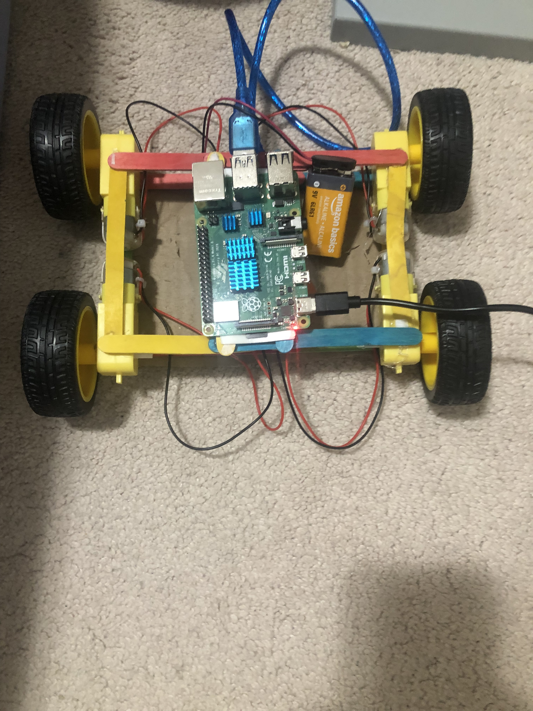

# Small car

I think this blog should be more of a weekly thing. Not tutorial because didn't really learn anything "tutorial-worthy". First time in a long time I worked on both car and website

## Website

So to the website, didn't do much this week. Just made the publishing aspect a bit easier. I made it so that, instead of me compiling my markdown to blogs (see more [here](https://arjuns-prologue.vercel.app/post/motors-site-generator-json), second part). 

Also just now, as I am writing this blog, I made images a little smaller and easier to look at. 
 
It's not taking up the entire page anymore. Now this blog is blog isn't just "functional", it's to the point where it's at a low-effort blogger type. Semi-styled, semi-polished. I don't know if I'll keep commiting to it though. 

OH YEAH! I added CodeRabbit to the repo, which is why I have a bunch of random commits where I just add a semicolon to one place.

## Car

So the car can now be controlled. 
NOT JUST CONTROLLED. 
WEB DASHBOARD BABY!!! 

 

Doesn't look too good, but functional. Also the car was kinda not moving too much, motors stalling, so I just made it as small as reasonably possible. 

(^^ is current, this is what it was earlier)

Didn't test it, but now it should be alright. Gave the Pi more air, couldn't secure the Arduino so it's kinda just freeballing. Wires everywhere but hopefully the wheels don't run over them. 
UPDATE: Just tested and it's way more snappy then it used to. Works like a charm though. No issues. Pretty sick huh? I should see how to put videos in this blog

Also, I asked ChatGPT what the next step of this project should be, if I want to learn robotics as a whole (there's a bunch of stuff to it, not just a few wires and boom). It said I should implement a PID Controller (basically it's an algorithm to help you get from one point to another but like more accurately, by seeing where you are and where you need to go and continously adjusting, kinda like us). So that's where I'm headed to. Then maybe computer vision or ROS, but that's for another day.

## Ending

Yeah as I said, blog should be weekly. So I can work on something reasonable every day and by the end I didn't make too much progress that I glossed over projects, but not too little that I just added a semicolon here and there. I should do these on the weekends, during the weekdays I wanna grind. But anyways, whatever's outside I hope it's good.
