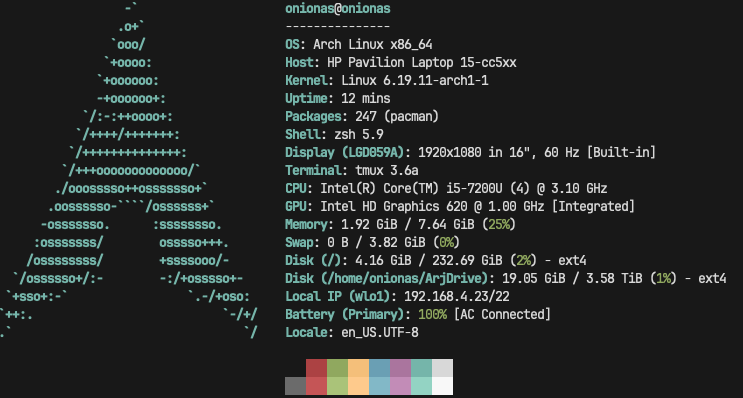

# NAS + bye RPi :(

## Intro

YOOO I MADE A NAS AND IT'S SICK. I'm literally making this on a Chromebook. It's so cool, I can code from any hardware anywhere in the world (still have to do the anywhere in the world part). But also my RPi is completely broken. I tried an entire process that's too big for just an intro; but me and ChatGPT concluded that he's six feet under. Imma buy a new one though, it's fine. Sorry I didn't post for a while again; I actually did make this post last week, but then the NAS had an issue and the post just disappeared, so I had to redo it. But yeah, let's get into it.

## NAS

So what I did was I took my older brother's crusty computer right. Then I installed Arch on it (because Arch is just so lightweight), I told it to stay on forever even if the lid is closed and now it's just in my room making barely any sound. Specifically it's an HP Pavilion Laptop 15-cc5xx with these specs:

I also have this 4TB external hard drive that just stores every project of mine from 2022, so I connected that to the NAS and I can code anywhere.

### Issues
There were two issues. First was the general architecture of this project. Thought I could `sshfs` the external hard drive to my Mac and code normally as if there's just a big folder locally (`sshfs` is just a tool to mount folders on a remote `ssh` onto your local computer). It was pretty fast with an `npm i` tool 111 seconds (sarcasm). So after a little arguing with ChatGPT, I decided to just `ssh` into the NAS there (what I'm doing currently), meaning I transferred my NeoVim config and terminal setup to the NAS locally (I took on a big NeoVim sidequest, the details are in Extras). 
The second issue was just general Arch. I think by ego I thought it would be seamless, but SOMEHOW issues came (tbh I did install Arch like 10 times before). 
<ul>
<li>First install -> missed something really important (it crashed out)</li>
<li>Tried to fix -> fixed but booted in emergency mode all the time</li>
<li>Gave up and reinstalled -> did with `archinstall` (install `arch` but with a GUI) - kinda embarrassing but we all dying one day  ✌️😔</li>
</ul>

### Thoughts, results, after effects
Really happy about this. I can code on a Chromebook with a fire NeoVim setup and a sick terminal. My result is an old computer, that can be turned into a server. Docker is installed so I can run different processes. I originally wanted to do this because I wanted to do a thing with AI and NeoVim (in Extras) but it was SO SLOW. Ig I just don't have the hardware for it, but you can still use it as a perfectly fine NAS. The difference between NAS workflow and local workflow is slightly different, NAS being a little more tedious but otherwise a fair tradeoff.
<ul>
<li>Links don't autoopen</li>
<li>`sshfs`, permissions, etc</li>
<li>Every time I want to code, I gotta ssh into my NAS (I did make an alias for it though so in terminal I just type `nas`)</li>
<li>Obviously over wifi so it's sometimes slow</li>
</ul>

I've been looking into `nginx`, planning to do that. I know the free tier makes you change the port every time you re-run, and I'm pro FOSS, but it's a server anyway so it's *going* to be running infinitely. It's so fun to do stuff with FOSS, not because of money but because of the hard work and creativity that goes into it. If there's a paid software, it's a joy to find something else that does that same thing or even to just do it manually and take apart the software.

## RPi
The Raspberry Pi is just fully dead. I think the MicroSD slot is dead, I tried 3 different ones (and good ones too). I tried USB booting, which automatically works on newer Pi 4s but it turns out mine's isn't new. With older RPi 4s, you can *still* USB boot, but the problem is you have to flash a special image onto the SD that changes the bootloader to allow USB booting, but again, you *need* the SD card to do that (WHICH I DON'T HAVE). No way I could find to fix it, if you have any ideas then the [Reddit post](https://www.reddit.com/r/raspberryDIY/comments/1s5jy5l/comment/ocvjpsx/) is literally asking for you.

## Extras

### NeoVim sidequest
By pure luck, completely unrelated, a week before I wanted to make a NAS, I just randomly decided to make a [github repo](https://github.com/awesomearjun/neovim-setup) of my config. But as I cloned the repo into Arch, I realized my Primegean `packer.nvim` config was deprecated so I took on a big side quest to convert it all to `lazy.nvim`. Just ChatGPT'd most of it, check it out if you want.  
I also tried to make NeoVim like Cursor which was a fun experience. Basically, after the homework bot the `ollama` craze still lingered, so I discovered [codecompanion.nvim](https://github.com/olimorris/codecompanion.nvim) which is a plugin that puts a sidebar into NeoVim, and has a bunch of features not limited to:
<ul>
<li>Agent mode - lets the bot edit for you</li>
<li>Is basically integrated into NeoVim - can access last terminal error, LSP errors, buffers</li>
<li>Code workflows - entire workflows for the bot so it can code, test, run, and repeat</li>
</ul>
 
10/10 plugin. I tried to run `ollama` on the NAS and connect that port to `codecompanion.nvim` but I don't have the hardware. I know there are cloud models on `ollama` with stupidly high token limits, and I will use them, I just forgot to connect the cloud models. Combo it with `copilot.nvim` and you're a soy dev. 
BUT YOU CAN'T JUST HAVE NEOVIM! I did configure a good [p10k](youtube.com) setup; idk why I put that in caps it was really easy.

### Website
I really don't want to work on the website, but I realized I can't actually access it on my little Chromebook because it looks horrible. Maybe I can `codecompanion` workflow the website to mobile?

## Outro
My bad for not posting, again, I did draft a post but somehow it just disappeared. But yeah, really happy with NAS and NeoVim, really sad about RPi. Hope whatever's happening on the other end is only positive; peace.
